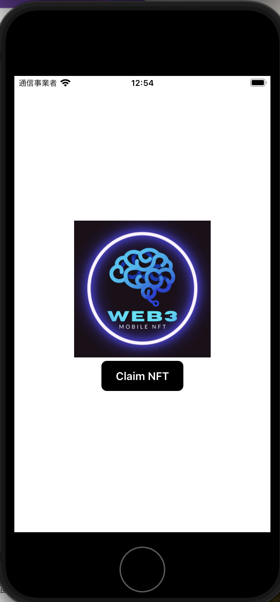

# Web3MobileDemoApp

モバイル向け Web3 アプリケーション開発用リポジトリです。

## 起動した画面例



## ThirdWeb CLI によるテンプレプロジェクト作成方法

```bash
npx thirdweb create app
```

オプションで React Native、Expo を選択する。

```bash
 💎 thirdweb v0.13.27 💎

✔ What is your project named? … demo-app
✔ What framework do you want to use? › React Native
✔ What type of React Native project do you want to create? › Expo Project
Creating a new thirdweb app in /workspace/Web3MobileDemoApp/demo-app.

Downloading files with framework react-native. This might take a moment.
Installing packages. This might take a couple of minutes.
```

### 動かし方(モバイルの方)

success Saved lockfile.
Done in 88.67s.

Success! Created demo-app at /workspace/Web3MobileDemoApp/demo-app
Inside that directory, you can run several commands:

`yarn android`
Runs your app on an Android emulator or device.

`yarn ios`
Runs your app on an iOS emulator or device.

We suggest that you begin by typing:

`yarn ios`

## pod install がうまく行かないとき

`ios`フォルダ内の`Pods`フォルダと`Podfile.lock`ファイルを削除して再度`pod install`をトライしてみると良い。

### このアプリケーションのためにデプロイしたコントラクト

いずれも Mumbai にデプロイ

- ERC20Token
  - [0x27c89ec21b8C72875EcD1117396d56D1046f7B9E](https://mumbai.polygonscan.com/address/0x27c89ec21b8C72875EcD1117396d56D1046f7B9E)
- NFT(ERC721)
  - [0x715b3C84Eb0ae82F71D2441Fc041bfCDB3a46AB3](https://mumbai.polygonscan.com/address/0x715b3C84Eb0ae82F71D2441Fc041bfCDB3a46AB3)
- NFT(ERC1155)
  - [0xFf78AD78350a29Fb67642852aEC2db34C32d605b](https://mumbai.polygonscan.com/address/0xFf78AD78350a29Fb67642852aEC2db34C32d605b)
- Account Factory
  - [0x73985d4e6f8cc92a338ee9e6a13be607680cac5d](https://mumbai.polygonscan.com/address/0x73985d4e6f8cc92a338ee9e6a13be607680cac5d)

### 作成したスマートウォレットのアドレス

[0x1227dae5b0d8b5dfd8a8026e5768577a8c5bf566](https://mumbai.polygonscan.com/address/0x1227dae5b0d8b5dfd8a8026e5768577a8c5bf566)

### 参考文献

1. [Youtube - How to Build the Ultimate Web3 Mobile App (2023)](https://www.youtube.com/watch?v=73YzK0SLfbQ)
2. [thirdweb React Native SDK](https://portal.thirdweb.com/react-native?ref=blog.thirdweb.com)
3. [Web3's iPhone Moment](https://newsletter.thirdweb.com/p/web3-iphone-moment-mobile-sdk-launch)
